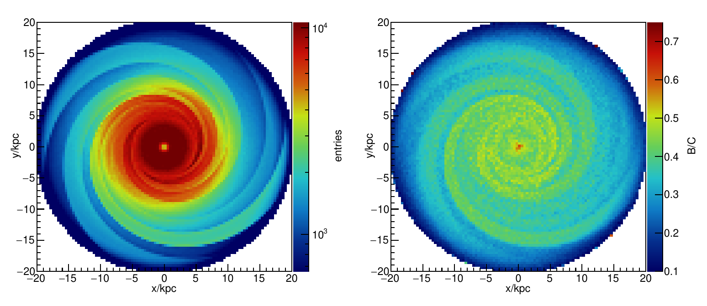

# GalMC
Simple SDE solver to test diffusion of cosmic rays in the Galactic magnetic field including nuclear spallation.

Example output:

## Dependencies

- `galtoolslib` from [GALPROP](https://galprop.stanford.edu/code.php) for nuclear cross sections
- `D2MW` from [DRAGON](https://codedocs.xyz/cosmicrays/D2MW/) for MW gas densities

## License

Released under GPLv3.
